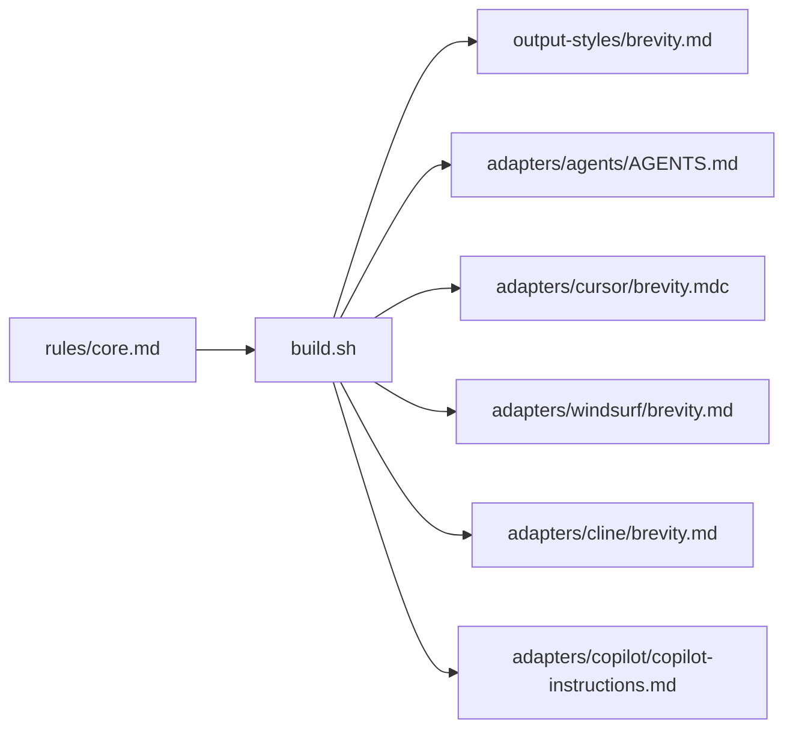

Brevity is a Markdown file that Claude Code loads into the system prompt at the
start of a session. Nothing executes. There's no hook, no script, and no
runtime.

That design has a consequence worth stating early: the rules are an instruction
to a language model, not a filter on its output. A model can ignore them. The
[benchmarks](/brevity/benchmarks) measure how often it doesn't.

## The three layers

The rule set has three layers, and they don't all apply at the same time.

| Layer | What it covers | When it applies |
|---|---|---|
| Banned words | 93 terms with plain replacements | Always, from a one-word answer to a long explanation |
| Banned behaviors | 17 patterns that produce text carrying no information | Always |
| Simplified Technical English | Sentence length, active voice, one meaning per word | Only when a reply runs past about three sentences |

Short replies skip the third layer. A fragment is correct when it's shorter and
still clear, so `Done.` and `222 staged.` are both valid output. Forcing those
into complete sentences would make them longer without making them clearer.

## The order rules apply in

When two rules disagree, the one higher in this list wins.

```steps
# Cut it

If deleting text preserves the meaning, delete it. The shortest correct answer
wins.

# Never write jargon

The banned word list is absolute. It applies to a one-word answer and to a
ten-paragraph explanation equally.

# Tone down

If a sentence can't be cut, make it plainer. Choose the simpler word and the
shorter construction.

# Go strict when long

Once a reply runs past about three sentences, Simplified Technical English
applies to it.
```

One rule sits above all four: never trade clarity for shortness. See
[what it keeps](/brevity/overview#what-it-keeps).

## Simplified Technical English

The rules for longer replies come from ASD-STE100, a controlled-English standard
written for aerospace maintenance documentation. It has 53 writing rules and a
dictionary of about 900 approved words.

Brevity paraphrases the writing rules. It doesn't include the dictionary, which
is copyright ASD, Brussels (EU trade mark 017966390) and can't be redistributed.
For rulings on specific words, read the free standard at
[asd-ste100.org](https://www.asd-ste100.org/).

> [!INFO]
> The standard exists because ambiguity in a maintenance manual gets people
> hurt, so its words are chosen to be short and unambiguous at the same time.
> That's the same tension Brevity has to hold: cut everything, but never cut the
> thing the reader needs.

## Safety words

Brevity replaces softened warnings with the three labels from the standard.
Writing "one thing worth flagging" where a real risk exists is the behavior
being removed.

| Label | Meaning |
|---|---|
| `WARNING` | The action can injure a person |
| `CAUTION` | The action can damage equipment, data, or a system |
| `NOTE` | Information you need, with no damage attached |

`CAUTION` isn't optional. It's required before anything that deletes,
overwrites, force pushes, publishes, changes a credential, or can't be undone
because the project has no version control. The rules that shorten replies don't
remove that line.

## One source, six formats

You edit one file. A build script renders it into the format each tool expects.



Run it from the plugin directory after any rule change:

```bash
./build.sh
```

The generated files are committed, so people can copy one without running
anything. Don't edit them directly; the next build overwrites them.

## The corpus

Alongside the rules, the plugin ships a skill holding 154 worked examples across
19 categories. Each is a real reply with its correction beside it.

The skill isn't loaded every turn. Only its description sits in context, at 88
tokens. Claude reads the matching section when a reply is about to go wrong,
which keeps the 5600-token body out of a normal session.

> [!NOTE]
> The corpus is a Claude Code skill. On other agents you get the rules without
> the worked examples.

## Next steps

- [The rules](/brevity/rules)
- [Benchmarks](/brevity/benchmarks)
- [Limits](/brevity/limits)
