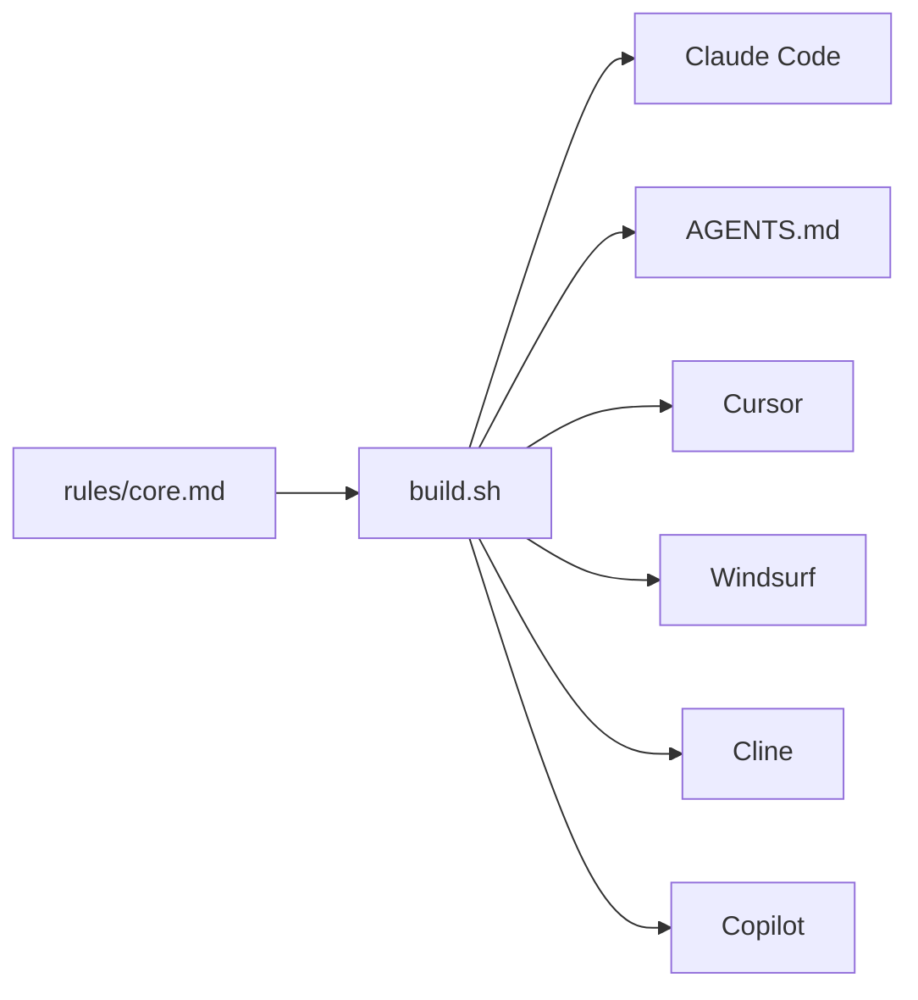

The rules were never specific to Claude Code. Only the packaging was. They carry
no code, so any agent that accepts a system prompt or a rules file can use them.

Clone the repository first. Every path below is relative to where you cloned it.

```bash
git clone https://github.com/pehcastro/harness
```

> [!WARNING]
> Only the Claude Code path is tested end to end. The files below are generated
> from the same source and match each tool's documented frontmatter, but they
> haven't been loaded in those tools. If one doesn't work, please open an issue.

## Copy the file your agent expects

````tabs
# Cursor

Copy the rule into your project. The file sets `alwaysApply: true`, so it
applies to every request without you selecting it.

```bash
cp harness/plugins/brevity/adapters/cursor/brevity.mdc \
   your-project/.cursor/rules/
```

# Windsurf

The file sets `trigger: always_on`.

```bash
cp harness/plugins/brevity/adapters/windsurf/brevity.md \
   your-project/.windsurf/rules/
```

# Cline

```bash
cp harness/plugins/brevity/adapters/cline/brevity.md \
   your-project/.clinerules/
```

# Copilot

```bash
cp harness/plugins/brevity/adapters/copilot/copilot-instructions.md \
   your-project/.github/
```

# AGENTS.md

Read by Codex, Amp, and a growing set of others. Append it instead if you
already have an `AGENTS.md`.

```bash
cp harness/plugins/brevity/adapters/agents/AGENTS.md \
   your-project/
```
````

## Any other agent

`plugins/brevity/rules/core.md` is the rule set with no wrapper around it. Paste
it into whatever your agent accepts: a system prompt, a custom instructions box,
or a rules file. It's plain Markdown and runs nothing.

## What you lose outside Claude Code

The corpus of 154 worked examples is packaged as a Claude Code skill, which
loads on demand when a reply is about to go wrong. Other agents have no
equivalent mechanism, so you get the rules without the examples.

The rules are self-contained, so this doesn't break anything. It removes a
fallback the model can reach for when it's unsure whether a sentence is
decoration.

## Keeping the formats in sync

You don't edit these files. They're generated, and the next build overwrites
them.



To change a rule, edit `plugins/brevity/rules/core.md` and rebuild:

```bash
cd plugins/brevity
./build.sh
```

The script is POSIX `sh`. It needs no node, no jq, and no python.

## Next steps

- [The rules](/brevity/rules)
- [Limits](/brevity/limits)
